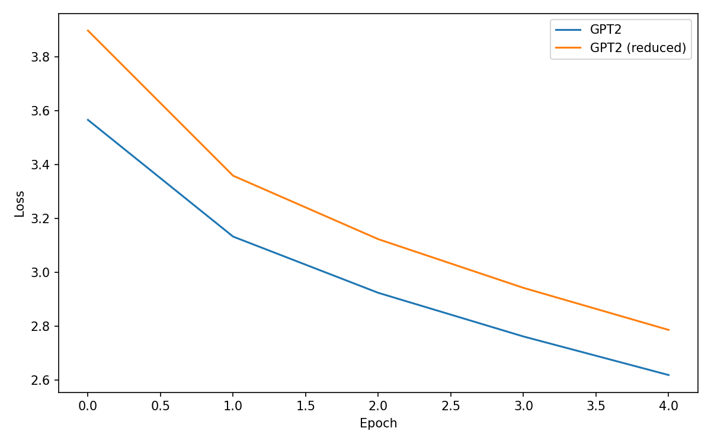
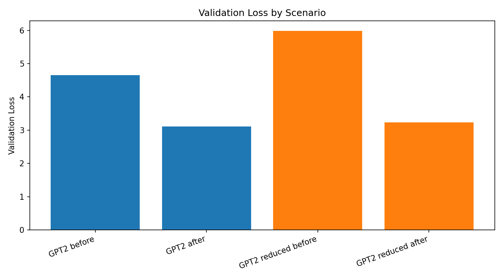
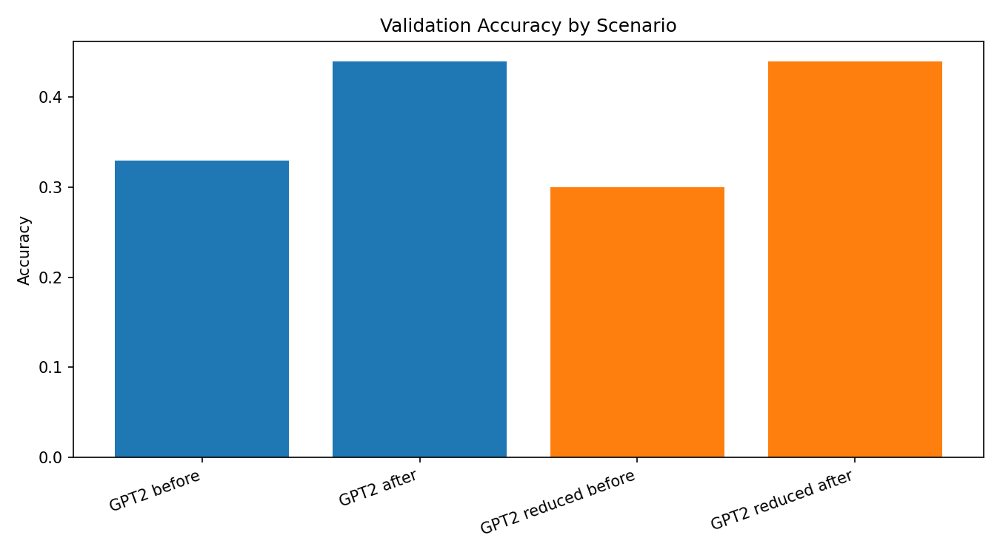

# BMW News GPT Fine-Tuning

This repo fine-tunes a GPT-2 model on BMW press-release text from https://www.press.bmwgroup.com/global/ and evaluates it with a small multi-choice QA set. It also trains a reduced GPT-2 variant (one fewer transformer block) and compares training loss, validation loss, and accuracy.

The training data was collected using the BMW press crawler at https://github.com/cuptea/bmw_crawler, which gathered 12,948 news items. To keep runs quick, this repo includes only 196 news files.

## Project Structure
- `gpt_fine_tuning_on_bmw_news_data.py`: main script (data prep, training, eval, plots)
- `src/`:
  - `bmw_functions.py`: data loading, eval, sampling, training utilities
  - `data/`: `data_loader.py`
  - `model/`: `gpt_model.py`
  - `visualization.py`: plotting helpers
- `data/` (expected):
  - `data/bmw_news/` — `.txt` files for training/validation
  - `data/bmw_multi_choice/data.csv` — multi-choice QA data
- `result/` (generated): PNG plots

## Example Data
News sample (`data/bmw_news/*.txt`):
```
================================================================================
Warm-up for Neue Klasse at BMW Group Plant Munich: Functional checks of new production equipment successfully completed
================================================================================

Date: 18.12.2025
Categories: Press Release, Sites, BMW Group Facilities, Production Plants, Logistics, Munich, BMW, Production, Recycling, Industry 4.0
URL: https://www.press.bmwgroup.com/global/article/detail/T0454539EN/warm-up-for-neue-klasse-at-bmw-group-plant-munich:-functional-checks-of-new-production-equipment-successfully-completed

--------------------------------------------------------------------------------

Summary:
--------------------------------------------------------------------------------
+++ Pure iFACTORY: digitally planned and built from the outset +++ Start of series production for new BMW i3 in the second half of 2026 +++

Full Content:
--------------------------------------------------------------------------------
BMW Group Plant Munich is ready for the
  production of the next vehicle generation. The manufacturing equipment
  has been installed in the new body shop and assembly line, and
  functional checks have been successfully completed. During this
  so-called "Common Function Test," every system undergoes dry
  runs, in which production planners and plant technicians put the
  machinery through its paces. All production steps are executed without
  any parts in the system. Cycle by cycle, an invisible vehicle takes
  shape. Although no actual car is produced, this process provides the
  certainty that everything operates seamlessly and as planned.
```

Multi-choice sample (`data/bmw_multi_choice/data.csv`):
```json
{
  "id": 1,
  "question_context": "The partnership between the BMW Group and UNICEF focuses primarily on creating what for young people?",
  "choice_1": "Employment contracts",
  "choice_2": "Educational opportunities",
  "choice_3": "Racing licenses",
  "choice_4": "Travel vouchers",
  "correct_label_index": 1
}
```

## Setup
```bash
pip install -r requirements.txt
```

## Run
```bash
python gpt_fine_tuning_on_bmw_news_data.py
```

## Outputs
The script writes comparison plots to `result/`:
- `training_loss_comparison.png`
- `validation_loss_comparison.png`
- `validation_accuracy_comparison.png`

## Training Hyperparameters (Current)
- Data sample fraction: `1.0`
- Train/validation split: `0.8 / 0.2`
- Batch size (B): `8`
- Sequence length (T): `64`
- Epochs: `5`
- Optimizer: `AdamW`
- Learning rate: `1e-5`
- Sample prompt: `BWM Germany today`
- Sample return sequences: `2`
- Sample max length: `300`

## Results
Below are the generated figures. They compare baseline GPT2 vs the reduced model before and after fine-tuning.

### Generated Sample Text
Comparison view (before vs after fine-tuning) for the main and reduced models.

<table>
  <colgroup>
    <col style="width: 50%;" />
    <col style="width: 50%;" />
  </colgroup>
  <tr>
    <th align="left">GPT2 (before)</th>
    <th align="left">GPT2 (after)</th>
  </tr>
  <tr>
    <td valign="top">
      <pre style="white-space: pre-wrap; margin: 0;">
BWM Germany today announced the discontinuation of the ASUS RTM Series, the successor to the Computer to the AMD Radeon R9 M395. 27 September 06:39 PM EDT - Radeon - R9 M395

Intel Releases A "New Open-Source Computer" for the Open-Source Intel open-source codename to the successor of the Intel Xeon Gold series? 27 September 06:59 PM EDT - Intel - "Biological Computing" and "Clima"

29 September

Solus Releases Their Plan To Get A Hold of Business x86 Speculation Mitigation Work While there have been rumors going on in recent days about what might end up being a new feature for the "EPYC 2" / Zen 2 processors / OpenCL driver support as a new release, a supervisor has been accidentally posted to Steam that finally get back to Windows 10.29 (and a lot of other stuff) 29 September 07:13 PM EDT - Hardware - Service Workers

Known With The Enemy 紫命の黒龍喚士・リエト 地夏太郎 不破圓明流継承者・不破北斗 七代目武装戦線・ジン=フリークス毒毒動 七代目武装戦線・ヤ魔モトP 十字
      </pre>
    </td>
    <td valign="top">
      <pre style="white-space: pre-wrap; margin: 0;">
BWM Germany today announced the addition of
  “Die Klingenblatt über die Neue Untersuchung der Menschen von Besammen (Procrastination)
  ist den Wirtschaftsleife.
In the Procrastination category, the BMW BMW Motorrad Performance
  Driving Assistant, with a focus on efficiency, performance and handling, received a
  Bronze Award for outstanding driving performance. The BMW Welt Motorsport
  Endurance Team has received another Bronze Medal for exemplary
  character.
Bild am Sonntag reports that, in the Procrastination category, the BMW
  Welt Motorsport team finished the standings with a total victory of
  six in qualifying. The BMW M5 CS and the BMW M5 GS finished the
  race in first and second places at the last ten laps but were unable to collect
  points in the penultimate session. In the Endurance
  category, Liebert Hooper (FRA) finished seventh, while Sean O'Connor (FIN)
  finished tenth.
The BMW M8 CS, with its 5.0-litre 4 x 10-speed twin-turbo automatic,
  was designated the sixth-generation of the BMW M Works team by the BMW Motorrad
  Performance Driving Assistant. The BMW M8 CS, with a 5.0-litre 4 x 10-speed twin
  engine with a
      </pre>
    </td>
  </tr>
</table>

<table>
  <colgroup>
    <col style="width: 50%;" />
    <col style="width: 50%;" />
  </colgroup>
  <tr>
    <th align="left">GPT2 Reduced (before)</th>
    <th align="left">GPT2 Reduced (after)</th>
  </tr>
  <tr>
    <td valign="top">
      <pre style="white-space: pre-wrap; margin: 0;">
BWM Germany today announced that its Call of Duty® Call of Duty® Extreme League™ have been awarded $2 billion USD by the National Association of Manufactured Masks. The award recognizes excellence in excellence in manufacturing and services related to manufacture and services related to professional brands and brands. The award includes $250 million USD from the National Association of Manufactured Masks; $250 million USD from the National Association of Manufactured Masks Manufacturing Advisory Council; and $250 million USD from the National Association of Manufactured Masks Manufacturing Advisory Council. The award also includes $250 million USD from the National Association of Manufactured Masks Manufacturing Advisory Council.

About Call of Duty® Extreme League™

Call of Duty® Extreme League™ combines excellence in manufacturing and services related to manufacturing and services related to professional brands and brands. The award recognizes excellence in excellence in manufacturing and services related to manufacturing and services related to professional brands and brands. The award includes $250 million USD from the National Association of Manufactured Masks Manufacturing Advisory Council; $250 million USD from the National Association of Manufactured Masks Manufacturing Advisory Council; and $250 million USD from the National Association of Manufactured Masks Manufacturing Advisory Council. For more information about the award and its methodology, visit www.callofdutyincorporated.com.

About Call of Duty® Extreme League™

Call of Duty® Extreme League™ combines excellence in manufacturing and services related to manufacturing and services related to professional brands and
      </pre>
    </td>
    <td valign="top">
      <pre style="white-space: pre-wrap; margin: 0;">
BWM Germany today announced that they have acquired the assets of “CALC USA”.
Date: 08.12.2025
Categories: Press Release, BMW M Motorsport, WorldSBK, BMW M Motorsport, MINI and MINI Cooper
URL: https://www.press.bmwgroup.com/global/article/detail/T0442235EN/b-motorsport-exclusive-with-the-bmw-m-cooper-warranty
Summary:
A brand-new, authentic and contemporary selection of premium automobiles from a newly established
  company at the heart of the company, this year marks the 50th anniversary of the
  BMW M Racing series, marking the first time it was not exclusively
  inspired by BMW M works cars. This award celebrates the BMW M works
  concept car for the first time under the name BMW M Racing. The award was
  awarded in conjunction with the Swedish Academy of Sciences for the
  collaboration between engineering and creativity, presented to each BMW M racer as
  a prize. The BMW M Racing Series is the culmination of the BMW M
  Motorcycle Collection, launched in 2008. Through this collection, the BMW M production
  vehicles have been made up of the BMW M4 Touring, BMW M4 Sedan and
BMW M4 Sedan Hybrid variants. Thanks to the support of BMW M Motorsport
  and MINI
      </pre>
    </td>
  </tr>
</table>


The training loss curve shows how each model converges across epochs.


Validation loss summarizes generalization before and after fine-tuning for both models.


Validation accuracy compares multi-choice QA performance across the four scenarios.

## Notes
- Logging is enabled in the script for progress visibility.
- GPU/MPS is used automatically if available. Otherwise, CPU is used.

## Future Work
- Add configurable training arguments (epochs, batch size, learning rate).
- Expand evaluation with additional QA sets and metrics.
- Add model checkpointing and resume training support.
